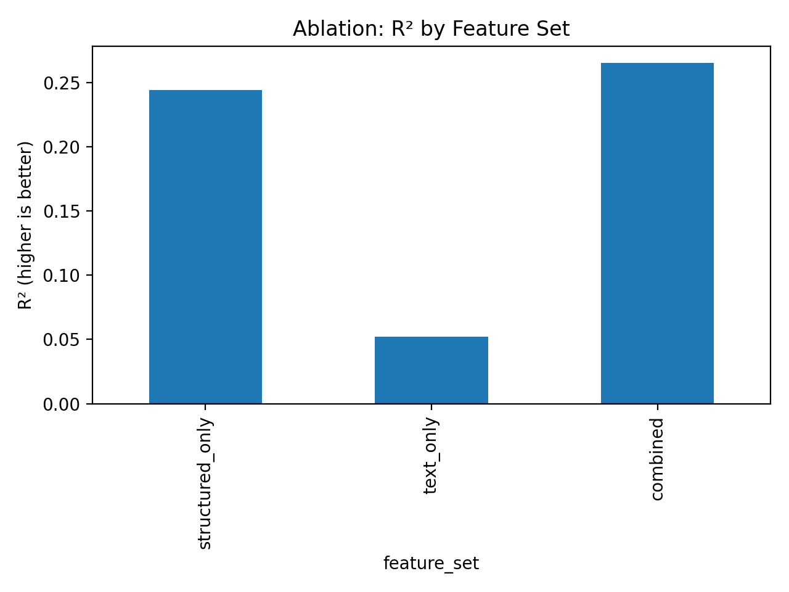

# City-Level Conflict Risk from News Text Signals

*One-sentence tagline:* A small end-to-end pipeline that turns GDELT news into city-month text signals and trains a simple baseline risk model.

## Abstract
This project is a student-built NLP prototype for turning news text into city-level, month-bucketed signals.
It downloads articles from GDELT, aggregates them into city-month documents, and builds TF-IDF plus numeric features.
A baseline regression model is trained to predict a forward-looking risk label.
The current label uses the structured field `Conflict_Events_Next` from `data/raw/MiddleEast.csv` as the outcome target.
No experimental claims are made beyond a runnable baseline pipeline.

## What this project does
- Fetches news articles from GDELT and stores them in a local CSV.
- Buckets articles into city-month documents.
- Builds TF-IDF text features plus numeric cues (e.g., sentiment and keyword counts).
- Trains a baseline model and saves metrics and plots.
- Uses the structured outcome label `Conflict_Events_Next` from `data/raw/MiddleEast.csv` and can be swapped for other targets.

## Data
- **Current source:** GDELT news articles.
- **Structured outcome label:** `Conflict_Events_Next` from `data/raw/MiddleEast.csv`.
- **Labeling note:** the label is a structured next-month conflict-event count and should be interpreted as correlational.

## Method overview
The pipeline builds city-month documents, extracts TF-IDF and numeric features, and trains a baseline regression model to predict a next-window risk label.

## Results
I ran an ablation study across three feature sets: structured-only indicators, text-only TF-IDF plus cues, and the combined feature space. The combined model shows a modest lift over structured-only features, while text-only performance is weaker, likely reflecting noisy or incomplete coverage in the news data.

| Feature set | MAE | RMSE | R² |
| --- | --- | --- | --- |
| structured_only | 4.950899447817316 | 5.911748150164717 | 0.2440319764114368 |
| text_only | 5.266851388233674 | 6.618965001071727 | 0.05234175191486434 |
| combined | 4.811011541920891 | 5.828704100851181 | 0.2651214102909344 |




### Reproducibility
```bash
make setup
make structured
make fetch
make features
make merge
make ablate_regression
```

### Limitations
- News coverage bias and reporting gaps can distort text signals.
- GDELT API rate limits can constrain collection windows and coverage.
- City-name mismatches across sources introduce noisy joins.
- Correlation does not imply causation; the model is not a causal analysis.

## How to run
```bash
python -m venv .venv
source .venv/bin/activate
pip install -r requirements.txt

# 1) Fetch GDELT articles
python -m src.ingest.fetch_gdelt

# 2) Build city-month docs + features (and forward-looking label)
python -m src.features.build_city_month_docs

# 3) Train baseline model + save metrics/plots
python -m src.models.train_baseline
```

## Outputs
- `data/raw/gdelt_articles.csv`
- `data/processed/city_bucket_docs.csv`
- `outputs/metrics.json`
- `outputs/roc_curve.png`
- `outputs/feature_importance_top.csv`
- `outputs/feature_importance_top.png`

## Roadmap
1. Integrate ACLED labels for real conflict event outcomes.
2. Add strict location-based splits to test geographic generalization.
3. Extend ablations (numeric-only vs text-only vs combined features) with more robust baselines.
4. Add Arabic modeling via AraBERT for Arabic-language coverage.
5. Add structured event extraction for more granular signals.

## Citation / disclaimer
This project is for research exploration only. Do not use it for operational or policy decisions. Correlation is not causation.

## Project context
[PASTE MY PROJECT DESCRIPTION + METHOD TEXT HERE]
